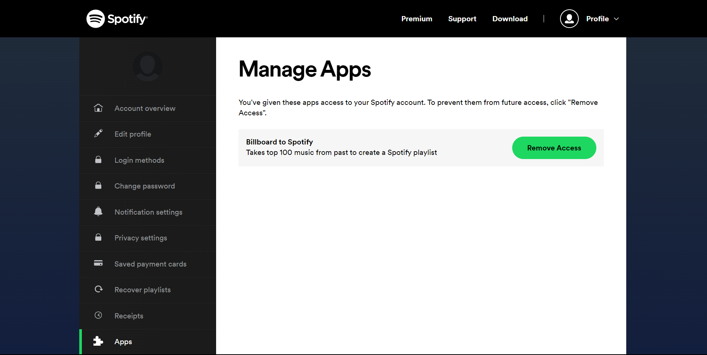

# Spotify Playlist Maker

This application scrapes top 20 songs of a given date from [Billboards](https://www.billboard.com/charts/hot-100/2020-08-12) website and create a new playlist in spotify using user's `CLIENT_ID` and `CLIENT_SECRET_KEY`. generated from user apps. Learn more about [Spotify API](https://developer.spotify.com/documentation/web-api/tutorials/getting-started) on official api documentation page.

---

### Dependencies

- python
- `spotipy`
- `BeautifulSoup`
- `requests`
- `spotipy.oauth2`
